# 🛒 Modelización de un Sistema de Compra-Venta de Activos Tokenizados
 *Caso Práctico Máster en Ingeniería y Desarrollo Blockchain*

Esta aplicación descentralizada (DApp) permite la gestión, compra y venta de activos tokenizados (Real World Assets - RWA) utilizando el estándar ERC1155 para los activos y ERC20 para la moneda de pago.

La plataforma ofrece un panel de administración para el Fondo de Inversión y una interfaz de usuario para inversores, permitiendo operaciones de mercado primario y secundario.

> ** 🌐 Demo Dapp (Testnet)**
> Hay disponible un despliegue en Vercel para interactuar con la Dapp y los contratos desplegados en Sepolia:     
> 👉 [Abrir Dapp](https://dapp-tokenized-asset-marketplace.vercel.app/)
> *Nota:Las funciones de administrador no estarán disponibles, a menos que se transfiera la propiedad de los contratos.*

---

## Índice
1. [🛠️ Tecnologías y Herramientas](#-tecnologías-y-herramientas)
2. [⛓️ Despliegue de Contratos](#-despliegue-de-contratos)
3. [📦 Instalación Dapp](#-instalación-dapp)
4. [✏️ Decisiones de diseño](#-decisiones-de-diseño)
5. [📋 Requisitos Técnicos](#-requisitos-técnicos)
6. [🧠 Otros aspectos técnicos](#-otros-aspectos-técnicos)

---

## 🛠️ Tecnologías y Herramientas
   
### Frontend & UI

* : Entorno de desarrollo y empaquetador ultrarrápido.

*  + : Biblioteca para interfaces de usuario con tipado estático.

* : Framework de utilidades CSS.

* : Colección de componentes UI reutilizables y accesibles.

### Web3 & Blockchain

* : Librería para interactuar con la Ethereum Virtual Machine (EVM).

* : Librería para conectar wallets.

* : Para lectura optimizada de NFTs y metadatos.

* : Almacenamiento descentralizado para imágenes y metadatos de los activos.

### Smart Contracts

* [🔗 Repositorio de Contratos](https://github.com/jc-delrio/Solidity-TokenizedAssetMarketplace)

* : Entorno de desarrollo para Ethereum.

* : Estándares de smart contracts (ERC20, ERC1155, Ownable, Pausable).

---

## 🚀 Despliegue de Contratos

Para desplegar la lógica de Smart Contracts en tu propio entorno:

1. **Clonar el repositorio:**
```bash
git clone https://github.com/jc-delrio/Solidity-TokenizedAssetMarketplace.git
cd Solidity-TokenizedAssetMarketplace
```
2. **Instalar dependencias:**
```bash
npm install
```

3. **Realizar Test de contratos (Opcional):**
```bash
npx hardhat test
```

4. **Añadir keystore (Hardhat):**
> ⚠️ INFORMACIÓN CONFIDENCIAL
```bash
npx hardhat keystore set --force RPC_URL
npx hardhat keystore set --force PRIVATE_KEY
npx hardhat keystore set --force ETHERSCAN_API_KEY
```

5. **Desplegar en Sepolia:**
Se usa hardhat mediante módulos ignition para el despliegue de los smart contracts.

<details>

<summary><b>🛠️ Ver configuración para Sepolia y Etherscan</b></summary>

- Se ha configurado la red Sepolia en hardhat.config.ts:              
 ```js
 export default defineConfig({
  // ...
  networks: {
    // ... otras redes
    sepolia: {
      type: "http",
      chainType: "l1",
      url: configVariable("SEPOLIA_RPC_URL"),
      accounts: [configVariable("SEPOLIA_PRIVATE_KEY")],
    },
  }
 });
 ```
- Se ha añadido la verificacíon de los smart contracts en etherscan también en hardhat.config.ts:             
 ```js
 export default defineConfig({
  // ...
  verify: {
    etherscan: {
      apiKey: configVariable("ETHERSCAN_API_KEY"),
    },
  }
 });
 ```

</details>

> Despliegue en lotes desde Acquisition.module.ts. Primero se despliegan los contratos DigitalCurrency, DigitalAssets, y posteiormente se despliega Acquisition en base a las direcciones de los dos anteriores        
```bash
npx hardhat ignition deploy ignition/modules/Acquisition.ts --network sepolia -verify
```

6. **Direcciones y ABI desplegados:**
En mi caso, he seguido el hash de la transaccion y comprobado que el contrato estaba verificado en etherscan.
Desde etherscan he obtenido las direcciones y el ABI de los contratos desplegados:
> Address DigitalCurrency: 0x9BE700De848c67cF1191aBFe6E1302F9cC2E80D6         
> Address DigitalAssets: 0x9900dF5742343fc7ff3A99BA9D105411D041DD1C         
> Address Acquisition: 0x08A414c2F10705e4ACdBa2D628a5038e1ECDAF8b     

<details>
<summary><b>🛠️ Ver detalles de contratos con mejoras implementadas</b></summary>

**Mejoras previas en contratos**             
En base a revisiones de la parte I, los smart contracts han sido ligeramente actualizados:
- Uso de uint256 para evitar comprobaciones de overflow (ahorro de gas).
- Función burn ejecutable por propietarios de tokens.
- Eliminación de comprobaciones positivas redundantes.
- Implementación de la extensión ERC1155Supply en DigitalAssets (mapping para el control de la cantidad máxima de cada token emitido)
- Se añaden eventos en contratos DigitalCurrency y DigitalAssets
- Se elimina la restriccón de no poder listar activos desde listNewAsset que ya han sido listados parcialmente, eliminando la funcion restockAsset

</details>

---

## 📦 Instalación Dapp
1. **Clonar el repositorio:**
```bash
git clone https://github.com/jc-delrio/Dapp-TokenizedAssetMarketplace.git
cd Dapp-TokenizedAssetMarketplace
```

2. **Instalar dependencias:**
```bash
pnpm install
```

3. **Configurar variables de entorno:**
Para poder usar todas las funcionalidades (administrador y usuario) es necesario crear un archivo .env en la raíz del proyecto con las siguientes variables:
```js
# Direcciones de los Contratos (Obtenidas tras el despliegue)
VITE_CURRENCY_ADDRESS=0x....
VITE_ASSETS_ADDRESS=0x....
VITE_ACQUISITION_ADDRESS=0x....

# Variables para RPC -⚠️ INFORMACIÓN CONFIDENCIAL
VITE_RPC_URL= tu_rpc_url
VITE_RPC_API_KEY=tu_rpc_api_key
```

4. **Ejecutar la aplicación:**
```bash
pnpm dev
```

---

## ✏️ Decisiones de diseño 
La arquitectura del sistema se basa en la interacción de tres contratos:

**DigitalCurrency (ERC20):** Para moneda del mercado CBCD.
Las funciones de este contrato se gestionan desde la Dapp para minteo, quemado y permisos relativos a la moneda digital o pausar/reanudar contrato.

**DigitalAssets (ERC1155):** Para activos tokenizados flexibles.
El fondo define los activos y sus metadatos.

**Acquisition:** Permite la compra/venta de activos tokenizados al fondo.
Este es el contrato principal de la Dapp, donde se realizan las transacciones de compra/venta de activos tokenizados entre el fondo y los usuarios.       

El caso de negocio implementado sigue la siguiente lógica:
- El fondo define los activos con los que trabajar. Se categorizan en los rangos definidos y se generan los metadatos correspondientes.
- El fondo libera al mercado los activos que desea, indicando la cantidad y el precio.
- Los usuarios pueden comprar los activos liberados por el fondo.
- Los usuarios pueden vender los activos que han comprado al fondo, siempre que el fondo los haya liberado con opción de venta.

---

## 📋 Requisitos Técnicos

### Interface WEB
La aplicación renderiza dinámicamente dos vistas principales **Administrador** y **Usuario**, dependiendo de si la wallet conectada pertenece al administrador (Owner de los contratos) o a un usuario estándar.

**Vista Administrador**        
El administrador centraliza el control financiero y de activos.

<details>

<summary><b>1. Gestión de CBCD</b></summary>

Permite mintear nuevos tokensCBCD a cualquier dirección indicada.     
Tambien es posible quemar CBCD del fondo (administrador).
En esta pestaña se visualiza la cantidad de CBCD a disposición del fondo.
> El administrador es el único que puede mintear moneda digital.

<div align="center">
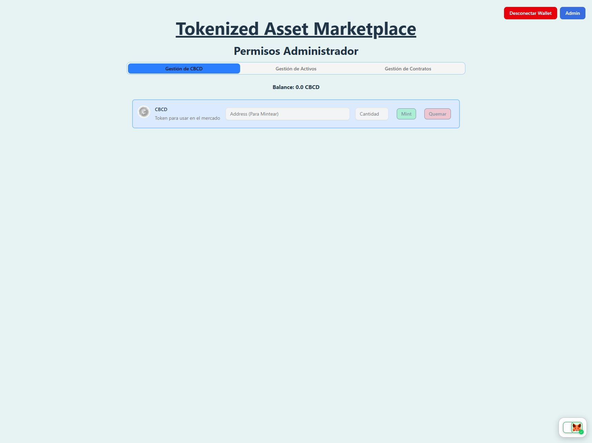
</div>

</details>

<details>

<summary><b>2. Gestión de Activos</b></summary>

Permite mintear nuevos activos. Estos activos se asignan al fondo (administrador), quien decide su liberación al mercado de forma progresiva.
> El administrador es el único que puede mintear nuevos activos.

<div align="center">
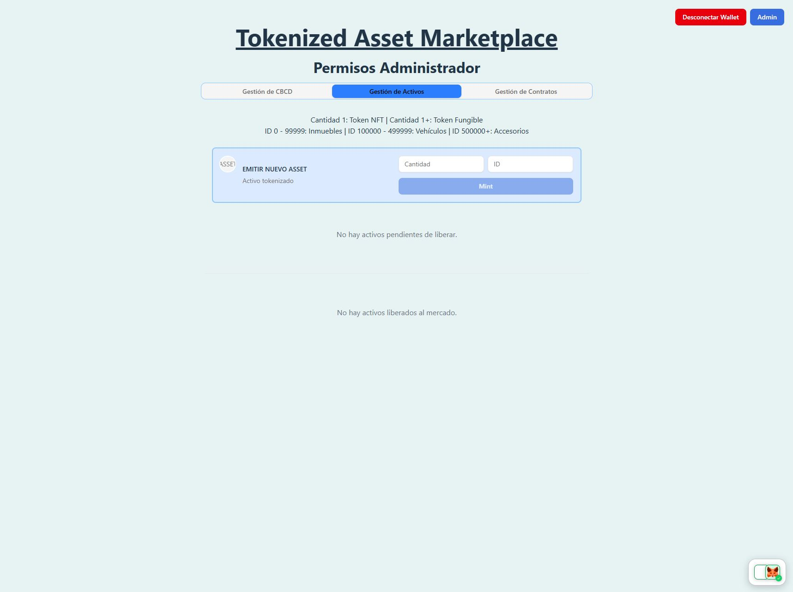
</div>

En esta pestaña es posible ver los activos minteados pendientes de liberar y liberados al mercado aún sin vender:
> El administrador es el único que puede gestionar los activos para su liberación al mercado.

<div align="center">
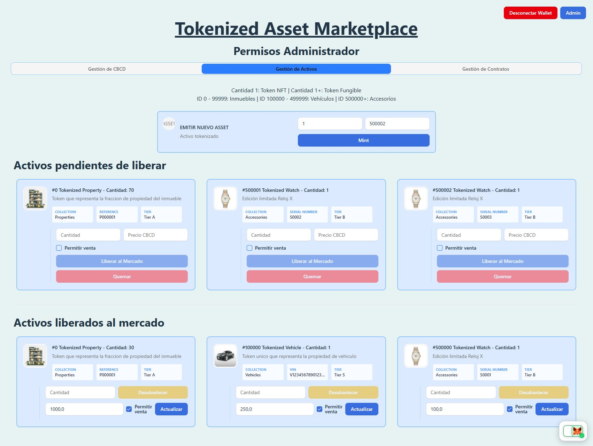
</div>

</details>

<details>

<summary><b>3. Gestión de Contratos</b></summary>

Permite Pausar y Reanudar los contratos:
> El administrador es el único que puede pausar y reanudar los contratos.

<div align="center">
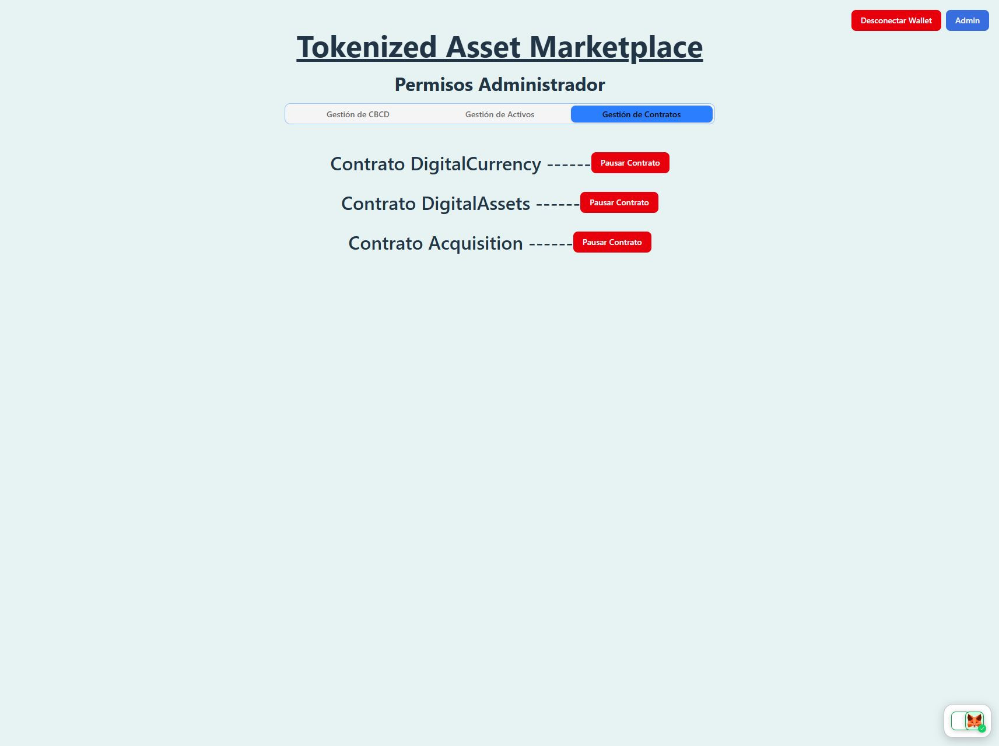
</div>

</details>

**Vista Usuario**         
Permite la interaccion con el mercado

<details>

<summary><b>1. Mis Activos</b></summary>

Permite transferir o quemar CBCD disponible, así como gestionar los activos que posee el usuario.
Esta pestaña muestra el balance de CBCD disponible para realizar compras.

<div align="center">

</div>

</details>

<details>

<summary><b>2. Ofertas</b></summary>

Permite ver las ofertas disponibles de activos liberados al mercado. Pueden ser ofertados por el fondo o por otros usuarios.

<div align="center">

</div>

</details>

<details>

<summary><b>3. Demandas</b></summary>

Permite ver las demandas que otros usuarios han realizado sobre activos liberados por el fondo pero que ya han sido comprados.

**...En desarrollo...**

</details>

### Visualización de Balances          
Obtención de balances CBCD mediante llamada a funcion *balanceOf* del contrato *DigitalCurrency*.
Este balance se actualiza si se realiza alguna operación.
```js
export const getBalance = async (address: string, signer: Signer) => {
    const CurrencyContract = new ethers.Contract(TOKEN_ADDRESS, tokenAbi, signer);
    const balance = await CurrencyContract.balanceOf(address);
    return balance;
}
```

<div align="center">
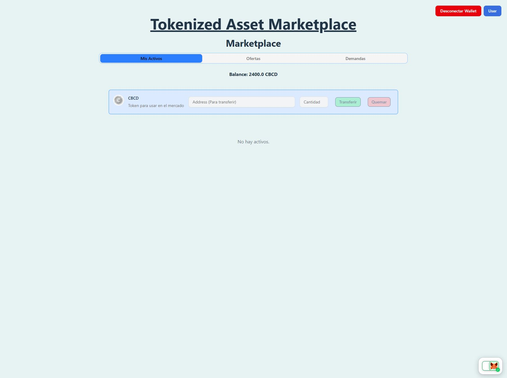
</div>


### Gestión de Emisión        
Solo el administrador puede acceder a la pestaña para mintear (CBCD o Activos).

<details>

<summary><b>1. Emisión de CBCD</b></summary>

Esta moneda digital tiene asignado un icono accesible desde Pinata IPFS.

Se puede mintear CBCD a cualquier dirección indicada:
```js
// CurrencyCard.tsx
    const handleMint = async () => {
        setIsMinting(true);

        try {
            const amountBI = parseUnits(amount, decimals);
            const result = await mintToken(address, amountBI, signer!);
            console.log(formatEther(result.value) + " CBCD emitidos a " + result.to);
            toast.success("Exito", {
                description: `${formatEther(result.value)} CBCD emitidos a ${result.to}`,
            });
        } catch (error) {
            console.log("Error al emitir CBCD", error);
            toast.error("Error", {
                description: `Error al emitir CBCD: ${error}`,
            });
        }
        setIsMinting(false);
        onUpdate?.();
    }
```

<div align="center">
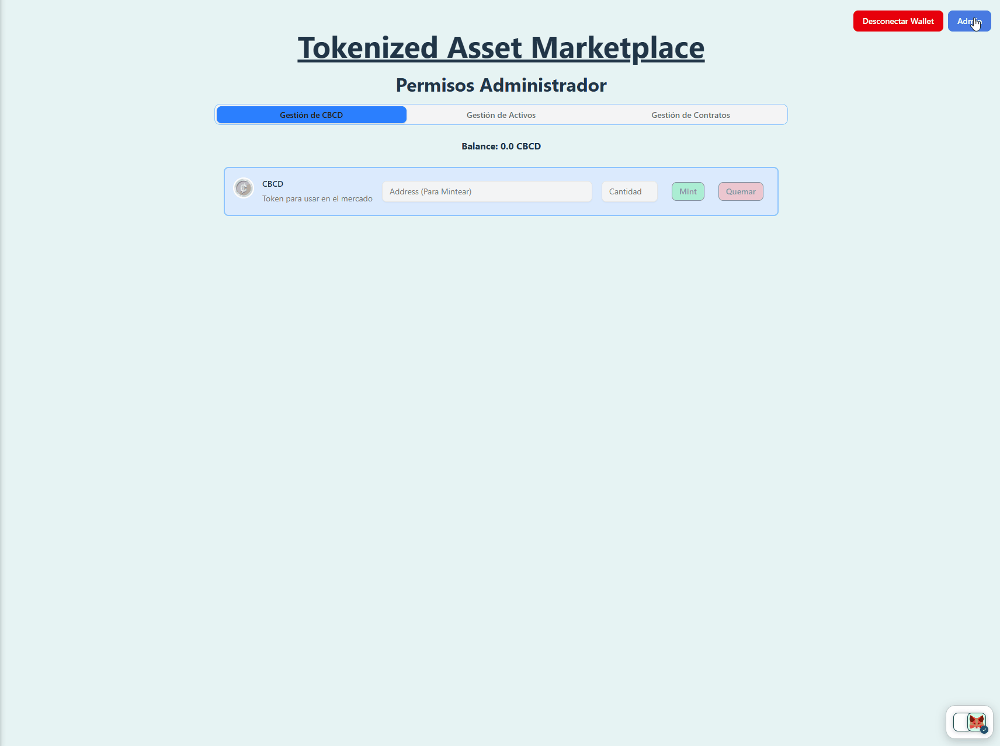
</div>

También es posible quemar CBCD del fondo (administrador):
```js
// CurrencyCard.tsx
    const handleBurn = async () => {
        setIsBurning(true);

        try {
            const amountBI = parseUnits(amount, decimals);
            const result = await burnToken(amountBI, signer!);
            console.log(formatEther(result.value) + " CBCD quemados");
            toast.success("Exito", {
                description: `${formatEther(result.value)} CBCD quemados`,
            });
        } catch (error) {
            console.log("Error al quemar CBCD", error);
            toast.error("Error", {
                description: `Error al quemar CBCD: ${error}`,
            });
        }
        setIsBurning(false);
        onUpdate?.();
    }
``` 

<div align="center">
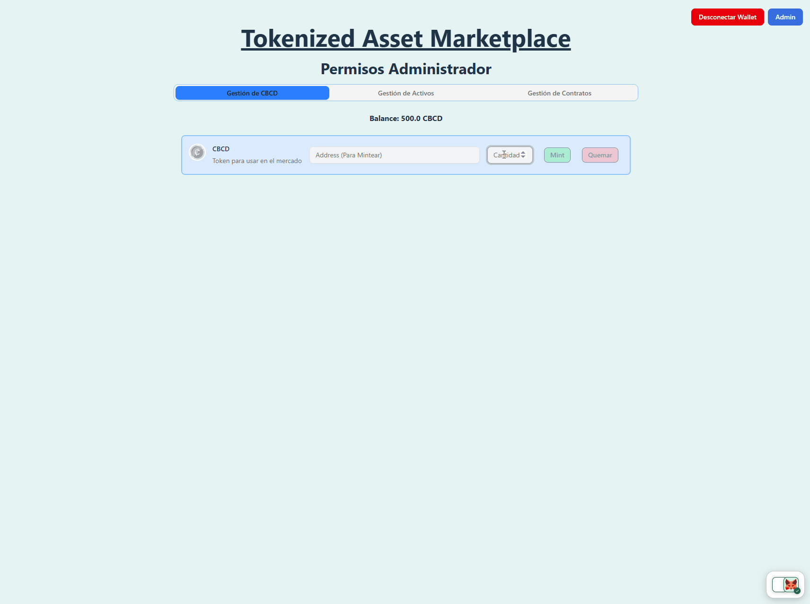
</div>

</details>

<details>

<summary><b>2. Emisión de Activos</b></summary>

Se pueden mintear nuevos Activos.
Para que los tokens emitidos dispongan de metadatos, previamente debe estar disponible en IPFS. Ver [Pinata IPFS](#-pinata-ipfs).
Estos activos pertenecerán al fondo (administrador).
```js
// MintAssetCard.tsx
    const handleMintAsset = async () => {
        setIsMinting(true);
        try {
            const amountBI = BigInt(amount || "0");
            const newToken = await mintAsset(id, amountBI, signer!);
            console.log(`${newToken.value} tokens (ID: ${newToken.id}) minteados a ${newToken.to}`);
            toast.success("Exito", { description: `${newToken.value} tokens (ID: ${newToken.id}) minteados a ${newToken.to}` });
        } catch (error) {
            console.error("Error al mintear:", error);
            toast.error("Error", { description: "Error al mintear" });
        } finally {
            setIsMinting(false);
            onUpdate?.();
        }
    };
```

<div align="center">
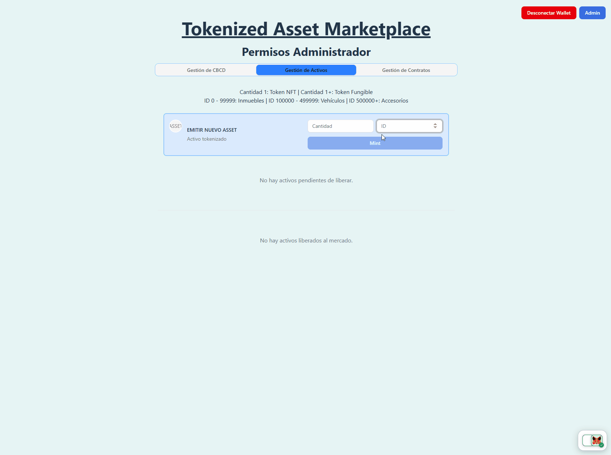
</div>

Los activos minteados pueden ser liberados al mercado, definiendo la cantidad de tokens a liberar, el precio y si se permite la venta.
Es importante mencionar que en este punto el administrador otorga permisos al contrato Acquisition:
- **setApprovalForAll**: Para la transferencia de activos (Necesario cuando un usuario compra)
- **approve**: Para la transferencia de CBCD (Necesario si un usuario vende al fondo). Por simplicidad se permite una cantidad 'ilimitada' de CBCD.

> La primera vez que se libera un activo al mercado se pediran permisos, despues se compureba que ya existen los permisos y no será necesario repetirlo.

```js
// PendingAssetCard.tsx
    const handleListNewAsset = async () => {
        setIsListing(true);
        const amountBI = BigInt(amount || "0");
        const priceWei = parseUnits(price || "0", 18);
        try {
            const tx = await listAsset(asset.tokenId, amountBI, priceWei, marketable, signer!);

            await checkApprovalForAll(account!, ACQUISITION_ADDRESS, signer!); // Damos permiso al contrato para gestionar los activos liberados al mercado
            await checkAllowance(ACQUISITION_ADDRESS, MaxUint256, signer!); // Damos permiso al contrato para gestionar los CBCD del fondo

            console.log(`${tx!.supply} tokens (ID: ${tx!.id}) "${marketable ? "venta permitida" : "venta no permitida"}" listados por valor de ${formatEther(tx!.value)}`);
            toast.success("Exito", { description: `${tx!.supply} tokens (ID: ${tx!.id}) "${marketable ? "venta permitida" : "venta no permitida"}" listados por valor de ${formatEther(tx!.value)}` });
        } catch (error) {
            toast.error("Error");
        } finally {
            setIsListing(false);
            onUpdate?.();
        }
    };
```

<div align="center">
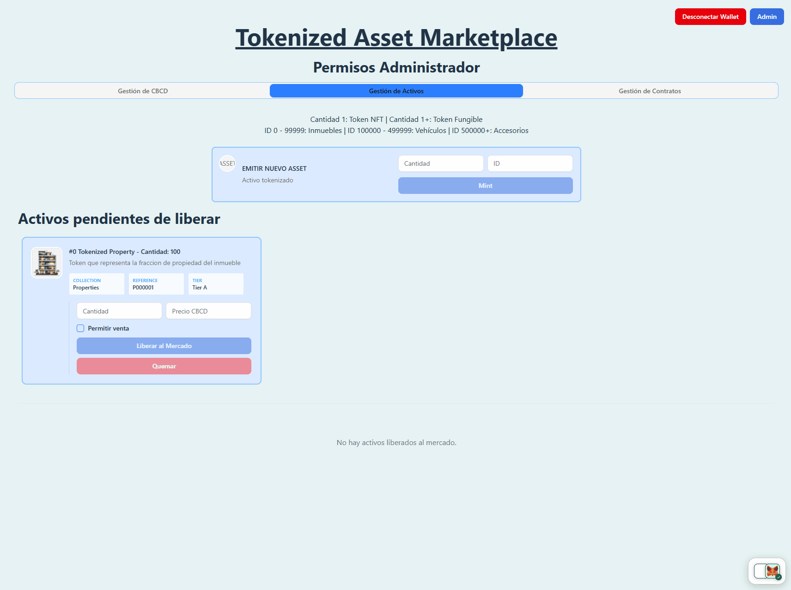
</div>

También es posible quemar Activos no liberados al mercado.
```js
// PendingAssetCard.tsx
    const handleBurnAsset = async () => {
        setIsBurning(true);
        try {
            const amountBI = BigInt(amount || "0");

            const tx = await burnAsset(asset.tokenId, amountBI, signer!);
            console.log(`${tx.value} tokens (ID: ${tx.id}) quemados`);
            toast.success("Exito", { description: `${tx.value} tokens (ID: ${tx.id}) quemados` });
        } catch (error) {
            console.error("Error al quemar:", error);
            toast.error("Error", { description: "Error al quemar" });
        } finally {
            setIsBurning(false);
            onUpdate?.();
        }
    };
```

<div align="center">
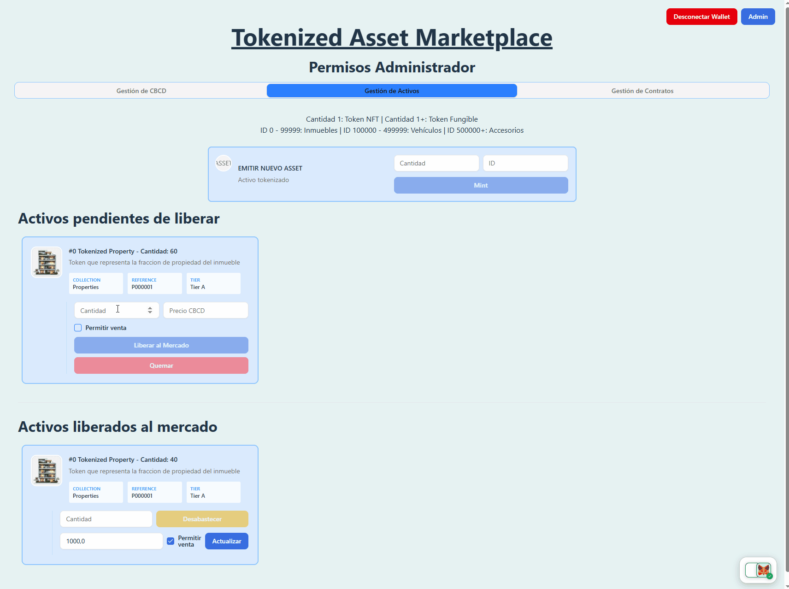
</div>

</details>

### Transferencias         

<details>

<summary><b>1. Transferencia de CBCD</b></summary>

Los usuarios pueden transferir su CBCD a cualquier dirección indicada.
```js
// TransferCurrencyCard.tsx
    const handleTransferCurrency = async () => {
        setIsTransferring(true);
        try {
            const amountBI = parseUnits(amount, decimals);

            const result = await transferToken(address, amountBI, signer!);
            console.log(`${result.value} tokens transferidos a ${address}`);
            toast.success(`${result.value} tokens transferidos a ${address}`);
        } catch (error) {
            console.error("Error al transferir:", error);
            toast.error("Error al transferir");
        } finally {
            setIsTransferring(false);
            onUpdate?.();
        }
    };
```

<div align="center">

</div>

</details>

<details>

<summary><b>2. Transferencia de Activos</b></summary>

Los usuarios pueden adquirir activos liberados al mercado.
Este proceso de compra requiere que el usuario otorgue permisos al contrato Acquisition para la transferencia de CBCD:
```js 
// SupplyAssetCard.tsx
await checkAllowance(ACQUISITION_ADDRESS, totalValue, signer!);
const result = await buyAsset(asset.tokenId, amountBI, signer!);
```

<div align="center">

</div>

También pueden vender los activos al fondo si este lo ha permitido en la liberación.
Este proceso requiero que el usuario otorgue permisos al contrato Acquisition para la gestión de sus activos:
```js 
// SupplyAssetCard.tsx
await checkApprovalForAll(account!, ACQUISITION_ADDRESS, signer!);
const newToken = await sellAsset(asset.tokenId, amountBI, signer!);
```

<div align="center">
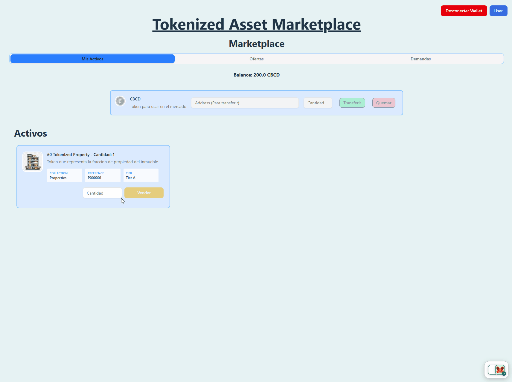
</div>

</details>

---

## 🧠 Otros aspectos técnicos         

<details>
<summary><b>📂 Ver Estructura de Archivos del Proyecto</b></summary>

```text
src/
├── assets/
├── components/
│   ├── common/
│   └── features/
│       ├── admin/
│       │   ├── assets/
│       │   │   ├── MintAssetCard.tsx
│       │   │   ├── ListedAssetCard.tsx
│       │   │   └── PendingAssetCard.tsx
│       │   ├── currency/
│       │   │   └── CurrencyCard.tsx
│       │   ├── AdminView.tsx
│       │   ├── ManageAssets.tsx
│       │   ├── ManageContracts.tsx
│       │   └── ManageCurrency.tsx
│       └── user/
│           ├── assets/
│           │   ├── OwnedAssetsCard.tsx
│           │   └── SupplyAssetCard.tsx
│           ├── currency/
│           │   └── TransferCurrencyCard.tsx
│           ├── ManageDemand.tsx
│           ├── ManageHome.tsx
│           ├── ManageOffer.tsx
│           └── UserView.tsx
├── contracts/
│   ├── abis/
│   │   ├── Acquisition.json
│   │   ├── DigitalAssets.json
│   │   └── DigitalCurrency.json
│   ├── functions/
│   │   ├── Acquisition.ts
│   │   ├── AlchemySDK.ts
│   │   ├── DigitalAssets.ts
│   │   └── DigitalCurrency.ts
│   └── utils/
│       └── decodeError.ts
├── hooks/
│   ├── useAssets.ts
│   ├── useChain.ts
│   ├── useOwner.ts
│   └── useWallet.ts
└── providers/
    ├── OnBoardWalletProvider.tsx
    └── Web3Provider.tsx
```

</details>

### Pinata IPFS
Se han subido a Pinata imagenes y metadatos para la moneda digital y 3 tipos de activos a modo de ejemplo.
El minteo de los activos se ha determinado por tramos para permitir una reserva de IDs de cada tipo de activo:

- 0 - 99.999 -> Inmuebles Tokenizados
Se emiten participaciones para inversión inmobiliaria. El mismo ID (inmueble) tendrá varios tokens en función de la cantidad de participaciones emitidas.

- 100.000 - 499.999 -> Vehículos Tokenizados
Se emiten tokens unicos por vehículos (NFT). Los metadatos serán unicos para cada activo, indicando el VIN del vehiculo.

- 500.000+ -> Accesorios Tokenizados
Se emiten tokens unicos por accesorios (NFT). Los metadatos serán unicos para cada activo, indicando el número de serie del accesorio.

> **Nota**: Los metadatos deben adaptarse a la imagen de cada activo y representar identificadores unicos del mismo.
> A medida que se emitan nuevos activos no previstos inicialmente, el contrato **DigitalAssets debe actualizar el CID** de la carpeta metadatos en Pinata:
> ```js
> setURI("ipfs://<CID>/")
>```


### Ethers.js
Se usa ethers.js para la interacción con los smart contracts.

**Conexión a wallet**
Se usa un provider con la librería **Web3OnBoard** para conectar la wallet del usuario. Esta librería nos permite conectar una wallet desde diferentes billeteras.

Se usan los hooks **useWallet** y **useChain** para transferir al resto de componentes la direccion de la wallet y la cadena usada.

Se usa el hook **useOwner** que recoge la dirección del propietario del smart contracts **Acquisition** y permite verificar si la wallet conectada es la del owner que desplegó el contrato.

<div align="center">
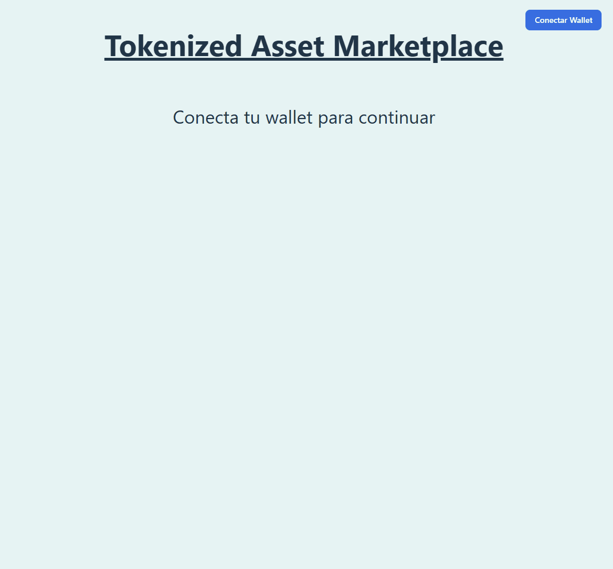
</div>

**Context Web3Provider y Hook useOwner**
Se crea un context provider **Web3Provider** que encapsula la app para facilitar información específica de la conexión, evitando la repetición de obtención de *provider* y *signer* en las diferentes funciones que interactúan con los smart contracts.

**AlchemySDK y Hook useAssets**
Se crea un hook **useAssets** que recoge la lista de los activos correspondiente a cada pestaña para su distribución a componentes.
Para la obtención de assets se usa el **SDK de Alchemy**, que nos permite obtener los activos de forma optimizada mediante **getTokensForOwner** .

**Decodificación de errores personalizados en smart contracts**
Se crea una funcion **decodeError** que nos permite decodificar los errores de los smart contracts, obteniendo el nombre de la funcion que ha fallado y los parametros que se han pasado a la funcion.

---

### License
This project is licensed under the MIT License.

